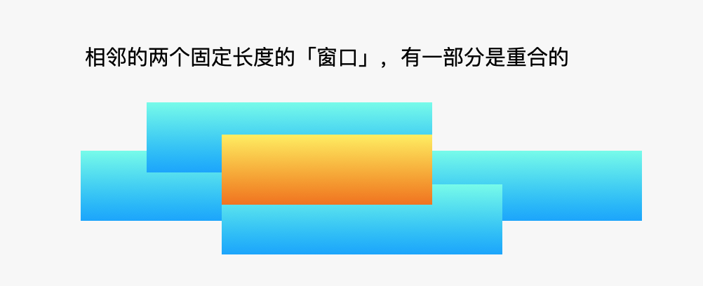

# LeetCode 643. Maximum Average Subarray I

- [LeetCode 643. Maximum Average Subarray I](#leetcode-643-maximum-average-subarray-i)
  - [题目](#题目)
  - [题解1](#题解1)

## 题目

You are given an integer array `nums` consisting of n elements, and an integer `k`.

Find a contiguous subarray whose **length is equal** to `k` that has the maximum average value and return this value. Any answer with a calculation error less than $10^{-5}$ will be accepted.

Example 1:

```
Input: nums = [1,12,-5,-6,50,3], k = 4
Output: 12.75000
Explanation: Maximum average is (12 - 5 - 6 + 50) / 4 = 51 / 4 = 12.75
```

Example 2:

```
Input: nums = [5], k = 1
Output: 5.00000
```
 
Constraints:

* `n == nums.length`
* `1 <= k <= n <= 105`
* `-10^4 <= nums[i] <= 10^4`

## 题解1

代码：[solution1.cpp](solution1.cpp)

我们可以枚举出所有长度为 `k` 的连续子数组（时间复杂度为 `O(N)`，分别求出它们的平均数（时间复杂度为 `O(N)`），从中选出最大的平均数。 事实上，相邻的两个长度固定的连续子数组，它们有一部分是重合的，在计算平均数的时候可以不用遍历。



由于窗口的长度固定，我们可以计算出所有的长度固定的连续子数组的和，在这些和中求出最大值，除以 `k`，就是题目要求的最大平均值

复杂度分析：

* 时间复杂度：`O(N)`，其中 `N` 是数组 `nums` 的长度。我们的算法遍历了数组一次。
* 空间复杂度：`O(1)`。